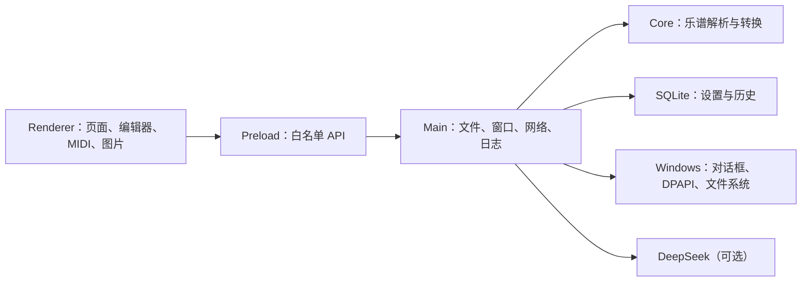

# SkyForce

> SkyStudio 乐谱转换与 AutoJS 桌面工作台（Windows）

SkyForce 是对本地 `www.AuToJs.com` 项目核心乐谱业务的 Windows 桌面化迁移。它是一款 Electron 单机应用，可在 Windows 10/11 64 位系统上独立运行，**无需安装 phpStudy、PHP、MySQL、Node.js 或浏览器**。乐谱转换、编辑、MIDI 提取与制图全部在本机完成，只有可选的 DeepSeek AI 和弦才需要联网。

## 功能

| 模块 | 说明 |
| --- | --- |
| 格式转换 | SkyStudio TXT / JSON、ABC 与 AutoJS JS 之间双向转换 |
| 脚本模板 | `press`（经典按压）、`press_new`（按压新/进度控制）、`long_press`（长按/延音）三种模板及模板互转 |
| 批量处理 | 最多 500 个文件的批量转换，单文件失败不中断批次，自动生成 `_2`、`_3` 重名后缀 |
| 历史记录 | 转换历史与错误记录保存在本机 SQLite，可查询、刷新、清空 |
| 乐谱编辑 | 15/21 键乐谱编辑，支持和弦输入、三种试听音色、脚本生成与 UTF-16LE TXT 导出 |
| MIDI 转 JSON | 本地解析 MIDI Format 0/1，支持速度变化、运行状态、时间量化与八度偏移 |
| 简谱长图 | 将乐谱排版为适合保存与分享的黑字白底 PNG 长图 |
| 自动和弦 | 本地规则和弦（离线），也可选用个人 DeepSeek API Key 生成 AI 和弦 |
| 旧项目迁移 | 从旧版项目目录一键导入模板、下载文件、转换结果与音色资料，源目录只读 |

## 运行环境

- Windows 10 / 11（64 位）
- 最终用户无需安装任何开发环境或运行时

## 安装与使用

从 `release` 目录选择对应产物：

- `SkyForce-1.0.0-x64-setup.exe`：NSIS 安装程序，支持自定义安装目录
- `SkyForce-1.0.0-x64-portable.exe`：免安装便携版

首次启动会在 `%APPDATA%\SkyForce` 自动创建 SQLite 数据库和日志目录。转换与编辑功能默认完全离线；仅在启用 DeepSeek AI 和弦时才发起网络请求。

> 注意：当前产物未做 Authenticode 代码签名，Windows SmartScreen 可能提示“未知发布者”。

## 界面概览

应用为单窗口工作台，侧边栏包含 8 个页面：

- **概览**：统计信息与常用入口
- **格式转换**：选择方向、模板、文件与输出目录
- **乐谱编辑器**：键盘录入（`c4-d4&e4~g4` 记谱，`- / ~ / ,` 分别表示默认、短、长间隔）、试听、生成 AutoJS、参考图/PDF 对照
- **MIDI 转 JSON**：选择 .mid/.midi，设置键位范围、八度偏移与量化后生成 SkyStudio JSON
- **简谱长图**：生成并保存 PNG
- **自动和弦**：本地规则或 DeepSeek AI，可一键应用回编辑器
- **历史记录**：转换记录、状态与耗时
- **设置与数据**：主题、21 键开关、默认导出目录、DeepSeek 配置、旧项目导入、自定义脚本模板

## 技术架构

### 技术选型

- **Electron**：复用原项目大量 JavaScript 交互与业务规则，自带 Chromium 与 Node.js 运行时，成品无需用户安装浏览器、PHP 或 Node.js
- **TypeScript**：全栈类型安全
- **Vite**：渲染进程构建
- **`node:sqlite`**：随 Electron 运行时提供的本地数据库，替代原 MySQL

### 分层



- [`src/core/converter.ts`](src/core/converter.ts)：不依赖 Electron 的纯业务转换核心，便于单元测试
- [`src/electron/main.ts`](src/electron/main.ts)：窗口、协议、IPC、文件、批处理、日志、DPAPI 与旧项目导入
- [`src/electron/preload.ts`](src/electron/preload.ts)：向界面暴露最小化、类型化的桌面 API
- [`src/electron/database.ts`](src/electron/database.ts)：数据库建表、迁移、设置与转换历史
- [`src/renderer`](src/renderer)：单窗口桌面界面及 MIDI、编辑、试听、图片、和弦工具

### 安全边界

- Renderer 启用 `contextIsolation` 与沙箱，关闭 Node 集成
- 本地资源使用只读 `skyforce://` 安全协议，IPC 校验调用页面，阻止外部导航
- 文件读写均要求绝对路径并限制大小
- DeepSeek 密钥通过 Electron `safeStorage` 使用 Windows DPAPI 加密，无法跨用户/跨机器解密

### 数据存储

默认目录 `%APPDATA%\SkyForce`：

| 路径 | 内容 |
| --- | --- |
| `data\skyforce.db` | 设置、转换历史与数据库版本 |
| `logs\skyforce.log` | 运行日志（不记录 API Key 与乐谱全文） |
| `legacy-imports\<时间戳>` | 用户主动导入的旧项目资料 |

卸载程序默认保留用户数据，避免误删历史与设置。

## 开发与构建

### 环境要求

- Windows 10/11 x64
- Node.js 24.x 与 npm

```powershell
npm ci --cache .npm-cache   # 安装依赖
npm run dev                 # 开发模式（热更新）
```

### 构建

```powershell
npm run typecheck           # 类型检查
npm test                    # 单元测试
npm run build               # 类型检查 + 测试 + 渲染/主进程构建
npm run dist:win            # 产出 NSIS 安装包与便携 EXE
```

或一键执行：

```powershell
powershell -ExecutionPolicy Bypass -File scripts\build-windows.ps1
```

### 包验收

```powershell
npm run verify:package      # 便携版验收：隔离临时目录启动、日志与 SQLite 初始化、SHA-256
npm run verify:installer    # 安装包验收：静默安装、已装程序自检、卸载
```

## 文件限制

- 批量输入：最多 500 个文件
- 单个转换文件：0–10 MiB
- 编辑器/文本读取：20 MiB
- 二进制参考文件：50 MiB
- 保存数据：100 MiB

## 已知限制

- AutoJS 脚本依赖目标 Android 设备上的 Auto.js 兼容运行环境；桌面应用只生成脚本，不模拟 Android 点击
- MIDI 支持 Format 0/1 与 PPQN 时间，不支持 SMPTE 时间格式、Format 2 及完整演奏控制器语义
- MIDI 到 15/21 键使用音高折叠/裁剪策略，超出 SkyStudio 音域无法做到音色级等价
- 简谱图片采用本地 Canvas 排版，不复刻旧网页的全部字体与主题
- 自定义音色包目前通过旧项目资料归档导入
- DeepSeek 是唯一需要网络的功能，可用性、费用与输出由服务商决定

## 文档

- [架构说明](docs/architecture.md)
- [迁移说明](docs/migration.md)
- [构建与发布](docs/build.md)
- [配置和数据](docs/configuration.md)
- [测试报告](docs/test-report.md)
- [已知限制](docs/known-limitations.md)

## 源项目保护

原项目位于 `D:\phpstudy_pro\WWW\www.AuToJs.com`，本桌面项目独立位于 `F:\SkyForce-window`。迁移过程只读取原目录，不会向其写入任何文件。

## 许可

[Apache-2.0](LICENSES/ORIGINAL-APACHE-2.0.txt)
