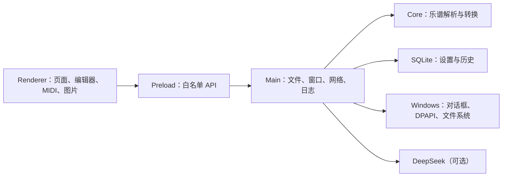

# 架构说明

## 技术选择

应用采用 Electron + TypeScript + Vite + 原生 `node:sqlite`。

选择 Electron 的主要原因是原项目大量交互和业务规则来自 JavaScript，能够在迁移时最大限度复用数据结构和算法；Electron 自带 Chromium 与 Node.js 运行时，成品无需用户安装浏览器、PHP 或 Node.js；`node:sqlite` 随 Electron 运行时提供，不再捆绑 MySQL 服务。代价是安装体积高于原生 .NET/Tauri，但迁移风险与维护成本更低。

## 分层

- `src/core/converter.ts`：不依赖 Electron 的纯业务核心，便于单元测试。
- `src/electron/main.ts`：窗口、协议、IPC、文件、批处理、日志、DPAPI 和旧项目导入。
- `src/electron/preload.ts`：向界面暴露最小化、类型化的桌面 API。
- `src/electron/database.ts`：数据库建表、迁移、设置与转换历史。
- `src/renderer`：单窗口桌面界面及 MIDI、编辑、试听、图片、和弦工具。

## 安全边界

Renderer 启用 `contextIsolation` 和沙箱，关闭 Node 集成；本地资源使用只读的 `skyforce://` 安全协议；IPC 校验调用页面；外部导航被阻止；文件读写均限制大小并要求绝对路径。DeepSeek 密钥通过 Electron `safeStorage` 使用 Windows DPAPI 加密。

## 数据流

转换任务由 Renderer 提交文件绝对路径与目标目录，Main 逐个读取并调用纯转换核心，成功后原子式写出单个结果并记录 SQLite 历史。单个文件失败不会中断批次。输出重名会自动增加 `_2`、`_3` 后缀。
